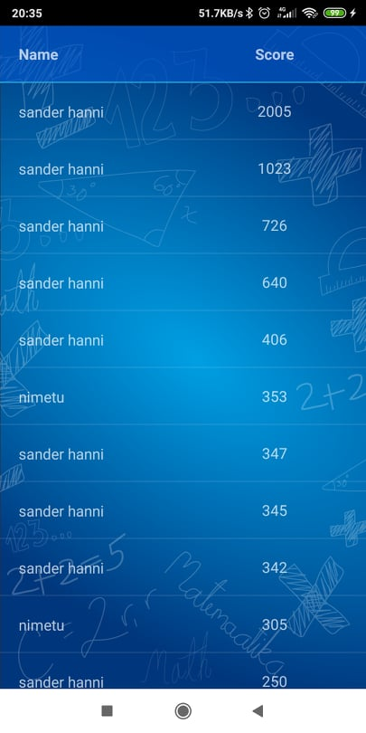
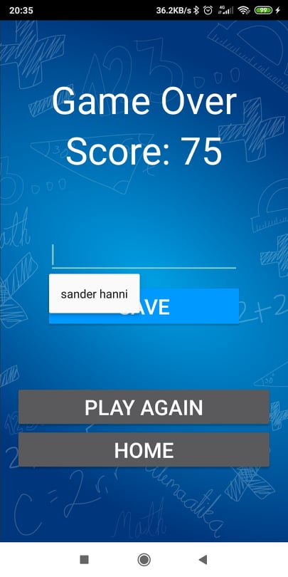
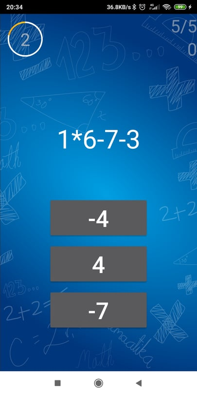
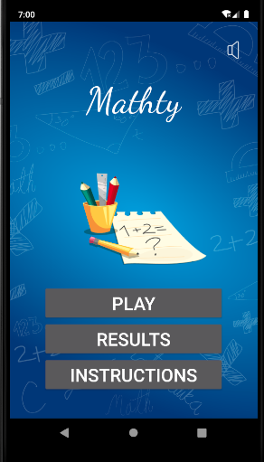
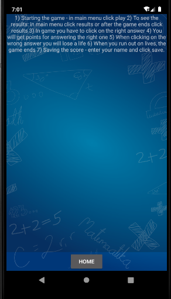

# Mathty

## Grupi liikmed
* **Sander Hanni**
* **Gertin Pakkonen**
* **Kristjan Treimann**
* **Andri Kaljumäe**
* **Petrik Sarri**
* *(Rando Aljaste)*

## Kirjeldus
Mathty on matemaatiliste tehete kiiruse peale peast arvutamise rakendus. Mängu eesmärk on testida enda peast arvutamise oskust liitmise, lahutamise ja korrutamis tehete abil. Mängija eesmärk on ära lahendada võimalikult palju tehteid ja saada suurim skoor. Kaasahaarav ja sõltuvust tekitav mäng, mis on sobilik igale vanusegrupile. 

## Platform
Android Native 

## Tarkvara nõuded
* Android studio 3.6.x
* Android SDK 24-29 (Android 7.0 - Android 10.0)
* Minimum Android SDK 24 (Android 7.0 Nougat)
* NDK    
    * 21.0.6113669
    * 20.0.5594570
    * 16.1.4479499
* LLDB 3.1
* Build Tools 29.0.3
* Android SDK Platform-tools 29.0.6
* Android SDK Tools 26.1.1

## APK
[Tõmba alla mathty APK](./apk/mathty.apk)

## Video

## Pildid

